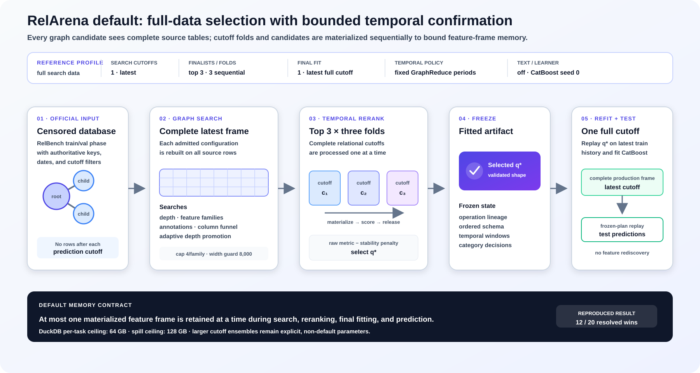

<p align="center">
  
  
</p>

## RelArena-α: Open and Reproducible Benchmarking for Relational Learning

---

| 📂 [Examples](examples) | 📊 [Baseline Results](baseline_results) | 🧩 [Add a Model](docs/adding-a-model.md) | 🗄️ [Your Own Database](docs/predictive-task.md) | 📄 [Model Report](https://arxiv.org/abs/2608.16319) |
|:---:|:---:|:---:|:---:|:---:|

---
</div>

**RelArena-α** is a unified framework for running and comparing baselines on
[RelBench v1](https://github.com/snap-stanford/relbench), standardizing data loading, evaluation
protocols, tuning regimes, and support for systems with custom tuning, inspired by established
tabular benchmarks such as [TabArena](https://tabarena.ai). This repository also open-sources
**TabPFN-Rel**, our relational harness for TabPFN-3, and an initial version of the
**Relational Predictive Interface (RPI)**. What the framework contributes:

- **Reproducibility.** Every reported method re-run through explicit model and system APIs, with
  implementations aligned, bugs fixed, and missing training scripts reconstructed.
- **Tuning regimes.** Model submissions declare only a search space and are tuned by the
  framework; system submissions bring their own regime.
- **One data state.** Every method sees the same database state during training, tuning, and
  evaluation.
- **Strong baselines.** GNNs (GraphSAGE, RelGT, RelGNN), relational foundation models
  (RT-PluRel), aggregation-based tabular methods (RDBLearn, TabPFN-Rel), and learning-free
  constant predictors.
- **Shared evaluation.** TabArena's `bencheval` for bootstrapped Elo, ranks,
  critical-difference diagrams, win rates, and normalized scores.
- **RPI.** Any RelArena-α method applied to your own database in two lines of code, with the
  database and task specified in YAML.

> [!NOTE]
> **Current status: α-release**, targeted at researchers and early-adopting practitioners. This
> release focuses on RelBench v1's entity-level forecasting tasks, and its task coverage,
> baselines, API, and tuning regime will evolve with community feedback. Research code, not
> production-ready. The model report covering RelArena-α, TabPFN-Rel, and the RPI is available
> at [arXiv:2608.16319](https://arxiv.org/abs/2608.16319).

## ⚡ Quickstart

> [!TIP]
> Preview the whole task grid without downloading anything, then tune LightGBM on one task and
> write every evaluated config to a CSV.

```bash
pip install "relarena[lightgbm]"          # Python 3.11 or 3.12

relarena --list                           # the 21 RelBench v1 entity tasks; no download
relarena --model lightgbm --datasets rel-f1 --tasks driver-dnf --output results.csv
```

Actually running a task retrieves its RelBench database (several GB for the full v1 set), so use
`--list` first. On macOS, prefix every command with `OMP_NUM_THREADS=1`: torch and lightgbm
bundle separate `libomp` runtimes, and lightgbm segfaults if torch loads first
([LightGBM#6595](https://github.com/microsoft/LightGBM/issues/6595)). Linux is unaffected.

For a reproducible checkout, the CPU-only torch build, or the leaderboard and plotting extras
(which need the source checkout), see [Installation](#-installation) below.

## 🕹️ Use Cases

<details>
<summary><b>🏟️ Benchmark a method across RelBench v1</b> — CLI sweep or in-process loop</summary>

The CLI runs one model across many tasks in-process and writes every evaluated config to a
CSV:

```bash
relarena --model lightgbm --datasets rel-f1 --output results.csv
```

On a large-memory machine, run independent tasks in separate worker processes:

```bash
relarena --model kurversc --parallel-tasks 10 --n-trials 1 \
    --model-config '{"full_training_frames": 3, "sample_rows": 10000, "feature_family_max_columns": 4}' \
    --output kurversc_all_tasks.csv
```

`--parallel-tasks` parallelizes complete dataset/task experiments only. Frame
construction, configuration trials, inner selection, and outer refitting remain
sequential within each task. Each worker exits after its task to release native
DuckDB/CatBoost state and relational frames; completed-task statuses print as they arrive,
while CSV rows retain the original task order. The default is `1`.

Each `(model, dataset, task, seed)` experiment is independent, so sweeps parallelize
trivially. The building blocks are all public: `run_experiment` executes one experiment,
`summary_to_dataframe` flattens it into the shared results schema, and concatenated frames
feed the leaderboard (needs the `leaderboard` extra):

```python
import pandas as pd

import relarena.models  # registers the built-in models
from relarena.evaluation import compute_leaderboard
from relarena.registry import registry
from relarena.results import summary_to_dataframe
from relarena.runner import run_experiment
from relarena.tasks import list_entity_tasks

frames = []
for spec in list_entity_tasks(["rel-f1"]):
    for model in ("constant-global", "lightgbm"):
        summary = run_experiment(
            registry.get(model), spec.dataset, spec.task, seed=0, n_trials=10
        )
        frames.append(summary_to_dataframe(summary))
board = compute_leaderboard(pd.concat(frames, ignore_index=True))
```

On a large-scale cluster, integrate that loop into your distributed backend of choice (a
SLURM array, Ray, ...): dispatch each experiment as one job, cache each job's result frame
keyed by `(model, dataset, task, seed, n_trials)`, and concatenate the cached frames for the
leaderboard. Warm the shared caches first (see the caching use case) so workers never pay the
preprocessing cost.

</details>

<details>
<summary><b>🧩 Add your own model</b> — the <code>fit</code> / <code>predict</code> contract plus a search space</summary>

We want the set of included baselines to be as representative as possible, so adding a method is
meant to be cheap. A model is a folder under `src/relarena/models/` implementing the
`RelArenaModel` contract (`fit` and `predict`) with a `SearchSpace` registered via
`@register_model(search_space=...)`; an end-to-end procedure implements
`RelArenaSystem.run` and uses `@register_system`. The registry discovers the folder automatically.
`models/lightgbm/` is the smallest complete example to copy.

The full guide is [docs/adding-a-model.md](docs/adding-a-model.md): the layout, the datatypes
`fit` and `predict` receive, the tuning regime and its choices, where shared code goes,
optional dependencies, vendoring requirements, tests, and a checklist. Whether your method
enters as a **model submission** or a **system submission** is the one decision to make up
front; see [adding-a-model.md](docs/adding-a-model.md#model-or-system) and the *Models and
systems* toggle in [Details](#-details).

</details>

<details>
<summary><b>🗄️ Run RelArena on your own database</b> — the Relational Predictive Interface (RPI)</summary>

The **RPI** generalizes the process that generated RelBench v1's entity-level forecasting tasks,
but replaces custom task-generation code with a declarative interface: the database and the
prediction task are specified entirely in YAML configuration files, without writing Python,
turning a collection of CSV or Parquet files into a RelArena-α task. `PredictiveQuery` is the
Python façade:

```python
from relarena.userdb import PredictiveQuery, PredictiveQuerySpec

spec = PredictiveQuerySpec.from_yaml("task.yaml", data_dir="data/")
predictions = PredictiveQuery(spec).fit("tabpfn-rel-client").predict()
```

Any registered RelArena-α method runs this way, hyperparameter tuning included. See
[docs/predictive-task.md](docs/predictive-task.md) for the task definition, SQL rules, split
semantics, and worked examples;
[`src/relarena/userdb/relbench_v1/`](src/relarena/userdb/relbench_v1) for example specifications
covering all 21 entity-level RelBench v1 tasks; and
[`examples/olist_seller_churn.py`](examples/olist_seller_churn.py) for the full path on a real
7-table Kaggle database. That example predicts seller churn, where held-out ROC AUC is 0.50 for
the global constant, 0.58 for entity-only LightGBM, 0.69 for the per-entity constant, and 0.79
for TabPFN-Rel.

Designing an interface for specifying relational prediction problems remains an open research
question, so this version is deliberately expressive, aimed at researchers and early-adopting
practitioners, and includes only limited safeguards against task mis-specification. Its
expressivity is intentionally constrained to entity-level forecasting tasks for compatibility
with RelArena-α, so not every predictive task over a relational database can be represented yet.

</details>

<details>
<summary><b>⚡ Precompute preprocessing caches</b> — optional, and worth it for DFS-heavy methods</summary>

Most competitive relational methods need hours of CPU-bound preprocessing per dataset before
training or inference: deep feature synthesis for flattening-based methods like RDBLearn and
TabPFN-Rel, graph materialization or tokenization for GNN-based methods like RelGNN and RelGT.
Running that inside a timed experiment is possible but impractical, because CPU-bound
preprocessing and GPU-bound training have different hardware requirements. RelArena-α therefore
permits methods to compute preprocessing artifacts once and cache them on disk before a run.

Caching is not required. RelArena provides an **optional, experimental** helper API in
[`relarena.cache`](src/relarena/cache.py) for local paths, miss policies, private scratch
computation, and atomic publication. A method may ignore this API and implement caching
independently. The helper does not bring cache warming into a timed RelArena experiment;
preprocessing scripts still run separately, so their runtime is not currently included in the
recorded experiment timings.

Regardless of the mechanism, cache-generation code must be public, so that others can
reconstruct the caches and reviewers can inspect them for errors such as label leakage. Some
practical pointers:

- Load data through `RelBenchDatasetTask.inner_split()` and `outer_split()` so the validation
  and test phase boundaries remain intact.
- Let the preprocessing implementation own its keys, versions, serialization, and validation;
  include only inputs that actually determine the artifact.
- Treat pre-built stores as a convenience: always ship a runnable warmer that can reconstruct
  them.

The full implementation guidance and reference code live in
[docs/adding-a-model.md](docs/adding-a-model.md#4-pre-processing-cache).

**Configure the store** explicitly at the run entrypoint:

```python
run_experiment(..., cache_dir="~/relarena-cache")
```

Entrypoints also resolve these environment variables once:

- `RELARENA_CACHE_DIR`: the store directory.
- `RELARENA_DISABLE_CACHE`: set to any value to disable persistent caches.

`RELARENA_DISABLE_FEATURE_CACHE` remains as a deprecated alias for one release. The helper
API's store is an ordinary local directory; remote snapshot transport belongs to deployment
infrastructure rather than RelArena itself.

**Precompute (CPU).** Because `fit` and `predict` read (a miss raises), build the store up
front with a fill run. The DFS engine (`fastdfs`) runs on CPU and is memory-hungry on
wide-fan-out schemas, so run it on a large CPU node (many cores, ample RAM); everything after
it runs on the GPU (or the hosted TabPFN API), so precomputing keeps that CPU-heavy step off
those nodes. The workflow warms every RelBench v1 task:

```bash
RELARENA_CACHE_DIR=~/relarena-cache \
    uv run --extra rdblearn python workflows/warm_feature_cache.py
```

It invokes `relarena.featurization.warm_cache` for both protocol splits and warms both
legitimate outer histories: train-only for RDBLearn and train+val for models that refit on
all labeled data. The `tabpfn-rel` and `rdblearn` models share full-anchor, leak-safe-history
matrices whenever their actual inputs match; model-specific row selection and downstream
training do not affect the key. On a warm cache the evaluation reads Parquet only, with no RDB
build and no DFS. RelGNN, RelGT, and RT-PluRel expose independent runnable warmers at
`relarena.models.relgnn.warm_cache`, `relarena.models.relgt.warm_cache`, and
`relarena.models.rt.warm_cache`.

**Runnable demo.** [`examples/tabpfn_rel_caching.py`](examples/tabpfn_rel_caching.py) fits one
RelBench task with and without a precomputed cache, reports both timings, and checks the
outputs are identical. On `rel-f1/driver-dnf` it turns roughly 409s into roughly 12s. Its
header includes a CPU-only mode (`RELARENA_EXAMPLE_SKIP_TFM=1`) that exercises the DFS and
cache path without a GPU.

</details>

<details>
<summary><b>📊 Aggregate results yourself</b> — leaderboards, plots, and reference baselines</summary>

[`baseline_results/`](baseline_results/) holds the release snapshot of the sweep over the 21
entity-level RelBench v1 tasks:

| File | Contents |
|---|---|
| `results.csv` | Every evaluated config of the release sweep (7 databases, 21 tasks, seed 0). Feed it to `compute_leaderboard`; pass `subset=` to filter which tasks the board covers. |
| `experiment_results.csv` | Same schema, for exploratory runs deliberately **excluded** from the default leaderboard (currently the experimental full-data-refit `relgnn` variant). |
| `reference_results.csv` | Per-task scores for methods **not reproduced in this pipeline**, transcribed from published model reports and flagged with a `_MR` (**model report**) suffix. |

`_MR` numbers are mostly self-reported and are often higher than the results reproduced through
RelArena; possible reasons are discussed in the forthcoming model report. With
few exceptions, these results are not comparable to RelArena-α runs and should only be used as
reference points. To rank or plot them anyway, load them with
`relarena.evaluation.load_reference_results` and pass the frame as `reference=`. See
[`baseline_results/README.md`](baseline_results/README.md) for per-method provenance and
[`baseline_results/SOURCES.md`](baseline_results/SOURCES.md) for every source token.

Aggregation runs on TabArena's `bencheval`, the evaluation library behind the TabArena
leaderboard. Given a RelArena results table, `relarena.evaluation.compute_leaderboard` computes
average ranks, bootstrapped Elo ratings with confidence intervals, pairwise win rates, and
normalized or baseline-relative scores (needs the `leaderboard` extra). Normalized-loss heatmaps
and the critical-difference diagram come from `relarena.evaluation.write_leaderboard_plots` with
the `plots` extra.

A board covers the tasks present in the frame you hand it, and any method without a result on
every one of them is dropped, with a warning naming it. `subset=` allows for creating custom
leaderboards computed on a restricted set of tasks. The filtering is run before the completeness
check mentioned above. `SUBSETS` ships two examples, allowing easy comparison on only
classification or regression tasks:

```python
from relarena.evaluation import compute_leaderboard

overall = compute_leaderboard(results)  # every task in the frame
classification = compute_leaderboard(results, subset="classification")
regression = compute_leaderboard(results, subset="regression")
```

In addition to providing a registry of example subsets, it is also easy to define custom
filters using `lambda` functions:

```python
board = compute_leaderboard(results, subset=lambda d: d["dataset"] == "rel-f1")
```

The `subset` argument of `write_leaderboard_plots` works analogously.

</details>

## 🪄 Installation

> [!IMPORTANT]
> Requires Python **3.11 or 3.12**. Installing from source additionally needs
> [uv](https://docs.astral.sh/uv/getting-started/installation/). RelArena pins `relbench`
> exactly, because the RelBench package version *is* the data version.

<details>
<summary><b>📦 From PyPI</b> — use RelArena as a library or CLI</summary>

```bash
pip install relarena                    # core: runner, tuner, registry, baselines, RPI
pip install "relarena[lightgbm]"        # plus one baseline's extra
```

No `--pre` flag is needed while the α-release is the only published version. The core install
carries torch, and the PyPI wheel is the CUDA build, so expect a multi-GB download; install from
source with `--group cpu` for the CPU-only build. The `leaderboard` and `plots` extras do **not**
resolve under pip, because `bencheval` is pulled from git rather than PyPI; use the source
checkout for those.

</details>

<details>
<summary><b>🌱 From source</b> — clone, sync, test</summary>

```bash
git clone https://github.com/PriorLabs/relarena.git
cd relarena
uv sync                          # the dev group (pytest, ruff, ...) installs by default
OMP_NUM_THREADS=1 uv run pytest  # the prefix is required on macOS; harmless elsewhere
```

Add `--group cpu` for the CPU-only torch build instead of the CUDA one, and
`--extra leaderboard --extra plots` for the reporting stack (`bencheval` resolves from git here,
pinned by `uv.lock`).

To run KurveRSC, sync its extra and invoke the ordinary RelArena CLI. KurveRSC is a system, so
its GraphReduce search happens inside its single RelArena trial; `--n-trials 1` is sufficient:

```bash
uv sync --group cpu --extra kurversc
OMP_NUM_THREADS=1 uv run relarena --model kurversc --datasets rel-stack \
    --tasks user-badge --n-trials 1 \
    --output kurversc_user_badge.csv
```

To run all 21 RelBench v1 entity classification and regression tasks with the published KurveRSC
defaults, omit `--datasets`, `--tasks`, and `--model-config`:

```bash
OMP_NUM_THREADS=1 uv run relarena --model kurversc --n-trials 1 \
    --output kurversc_all_tasks.csv
```

Add `--parallel-tasks N` only when the machine has enough memory for `N` complete tasks at once.
Each phase receives RelArena's officially censored database; KurveRSC searches connected
point-in-time frames, freezes the selected GraphReduce operations, refits from the full phase
tables, and replays that plan for validation or test prediction. Its bounded multi-fidelity
search explores GraphReduce feature-family combinations, depth, and automatic annotation while
pruning candidates that exceed the width guard or cannot produce features for the task schema.
The published KurveRSC default uses `search_full_data=true`, so every graph
configuration admitted by the search is evaluated on the complete latest-cutoff
relational frame. Set `search_full_data=false` for the lower-cost multi-fidelity
funnel: `screening_rows` controls its low-fidelity screen (`10000` by default), and `sample_rows`
controls the diverse confirmation-candidate budget (`50000` by default). The top candidates are
reranked on complete relational frames. `search_training_frames=1` uses the latest eligible
cutoff during graph search; larger values jointly fit search candidates across evenly spaced
cutoffs and require enough RAM to retain those search frames. `full_training_frames=1` (the safe
default) uses the latest eligible production cutoff, while a larger value selects that many
evenly spaced cutoffs and requires correspondingly more compute and spill space.
`feature_family_max_columns` limits how many source columns each automatic feature family expands
per node (`4` by default); set it to `null` to restore the uncapped search.

<p align="center">
  
</p>

<p align="center"><em>KurveRSC's published RelArena default uses complete source rows while processing graph candidates and temporal folds sequentially.</em></p>

</details>

<details>
<summary><b>🛠️ Developer setup</b> — everything, plus pre-commit</summary>

```bash
uv sync --group dev --group cpu --extra leaderboard --extra plots
uv run pre-commit install
```

Before opening a pull request:

```bash
uv run ruff format --check .
uv run ruff check .
OMP_NUM_THREADS=1 uv run pytest
uv build
```

See [CONTRIBUTING.md](CONTRIBUTING.md) and, for agent-facing notes, [AGENTS.md](AGENTS.md).

</details>

<details>
<summary><b>🧱 Baseline dependencies</b> — one extra per baseline, plus two special cases</summary>

Each baseline carries its own extra, and every heavy dependency is lazy-imported inside `fit`, so
registering a method works without its extra installed.

| Extra | Baselines | Notes |
|---|---|---|
| `lightgbm` | LightGBM | CPU only |
| `kurversc` | KurveRSC | GraphReduce configuration search + CatBoost; CPU only |
| `rdblearn` | RDBLearn | DFS (`fastdfs`) plus a local TabPFN; GPU recommended |
| `tabpfn-rel-local` | TabPFN-Rel (OSS) | same stack as `rdblearn`, text-free |
| `tabpfn-rel-api` | TabPFN-Rel (API) | DFS locally, fit and predict server-side; no GPU needed |
| `graphsage`, `relgnn`, `relgt` | GraphSAGE, RelGNN, RelGT | need PyG sampling wheels, see below |
| `rt` | RT-PluRel | Linux x86-64 wheel, see below |
| `leaderboard`, `plots` | (reporting only) | source checkout only, `bencheval` comes from git |

**GNN baselines: the PyG sampling wheels are not in the extras.** `graphsage`, `relgnn`, and
`relgt` build on RelBench's GNN stack (PyG + PyTorch Frame + a text embedder), pulled by their
extras. PyG **temporal (disjoint) neighbor sampling additionally needs `pyg-lib`** (plus
`torch-scatter` or `torch-sparse`; `torch-sparse` alone errors), which is deliberately *not*
declared: the right wheel depends on the target machine's torch/CUDA build (Linux and GPU only).
Install the matching wheels from the PyG index on the GPU machine, see
[docs/adding-a-model.md §6](docs/adding-a-model.md#6-optional-dependencies). End-to-end runs want
a GPU.

**RT-PluRel: Linux x86-64 wheel, GPU strongly recommended.** The pinned
`relational-transformer` package provides a stable-ABI wheel for Linux x86-64, the platform
currently supported by RelArena's RT integration, and a GPU is strongly recommended for practical
fine-tuning runtimes.

```bash
uv sync --extra rt                 # from a source checkout
pip install "relarena[rt]"         # from a release
```

</details>

## 📚 Details

<details>
<summary><b>🧭 How a run works</b> — splits, tuning procedure, and runtime policy</summary>

```
┌─ runner ───── fit config(s) on train -> pick best on val -> final fit -> test
├─ tuner ────── random search or a fixed grid under a caller-supplied budget;
│               records configurations, metrics, predictions, and phase timings
├─ model ────── RelArenaModel: fit / predict  (the contract)
├─ space ────── SearchSpace: what to tune over, bound to the model in the registry
└─ RelBench ─── Database, EntityTask, task.evaluate, metrics  (dependency)
```

**Tuning procedure.** Each method registers a search space in a standardized format together
with a default configuration. The search space is either sampled randomly, using the run seed,
or specified as a small fixed grid whose configurations are evaluated in a predefined order.
RelArena-α then performs tuning automatically: for each configuration it fits the method on the
inner split's training data and evaluates it on the corresponding validation data using the
task's primary metric. The configuration with the best validation score is selected and refit on
the outer split for final evaluation. The default configuration is refit under the same protocol,
so each method reports both an untuned and a tuned result. Methods additionally specify whether
the final fit combines the training and validation data or retains the validation split for
early stopping, following the protocol used in the corresponding publication. Search spaces may
not be tailored to individual datasets, except through coarse tiers based on dataset size.

**Nested temporal validation.** The database used during tuning (the inner split) is frozen at
the validation cut-off, mirroring how the final evaluation (the outer split) freezes it at the
test cut-off. This prevents access to post-boundary data and test labels, and it removes the
drift between tuning and evaluation regimes that made self-reported results incomparable. Within
the allowed database state, each method decides whether and how to enforce the finer timestamp of
every historical example; see [docs/temporal-validation.md](docs/temporal-validation.md) for the
complete guarantee and trade-off. The forthcoming model report discusses why those timestamp
boundaries are not yet standardized across methods.

**Runtime policy.** The current policy allows a maximum total runtime of 24 hours per task,
including preprocessing, measured on the largest tasks; moderately larger search spaces are
permitted on smaller tasks when their cost stays reasonable. The 24-hour limit is a ceiling, not a
target; all released baseline models except RelGT run for less than 12 hours even on the largest
tasks. Because equalizing tuning compute across methods remains unsolved, the α-release uses
documented, method-specific trial budgets chosen to approximately balance compute. See
[docs/tuning-regime.md](docs/tuning-regime.md), and the forthcoming model report for the full
budget rationale.

**What a run records.** Each trial keeps its configuration, metrics, optional predictions, and
separate tuning and final-fit timings, which is what makes tunability analyses and per-phase
runtime comparisons possible after the fact.

</details>

<details>
<summary><b>🤖 Models and systems</b> — the two submission types and the registered inventory</summary>

Following TabArena, method submissions are categorized as models or systems
(`RelArenaModel.kind`).

- A **model submission** follows the standardized tuning regime, which allows claims about
  isolated methodological effects. It only needs to declare a search space; RelArena-α controls
  configuration sampling, run scheduling, and selection of the final candidate. Search spaces may
  not be dataset-specific beyond coarse differentiations based on dataset size, and we provide
  them for all implemented methods, mirroring the authors' choices where possible.
- A **system submission** may use a custom tuning regime, such as Bayesian optimization or
  conditional search steps. Comparing systems with each other shows which end-to-end pipeline
  performs best under the same input, output, and time constraints. Between systems and models,
  final predictive performance is comparable, but efficiency and methodological improvements are
  not, because they may result from differences in the tuning regime.

This split accommodates novel research through system submissions while keeping reliable
research conclusions available from model submissions. Leaderboards should either exclude
systems (`compute_leaderboard(..., kinds={"model"})`) or rank both populations together with
systems clearly marked; publishing both boards side by side is the recommended presentation.

System support is currently **highly experimental**: systems run through the ordinary model API
with documented workarounds (all tuning inside a single fit of the default config, state carried
between the fit and refit phases via module-level globals), and a system submission needs extra
validation by and discussion with the maintainers. A future release will replace these
workarounds with an explicit fitting API for systems; see
[adding-a-model.md](docs/adding-a-model.md#model-or-system) for the current rules.

This is the canonical inventory of registered methods. The release snapshot and the forthcoming
model report contain the rows marked **report**; the additional `relgnn` registration is retained
as an experimental final-fit variant.

| Registered identifier | Report-facing name | Family | Kind | Status | Final fit | Extra |
| --- | --- | --- | --- | --- | --- | --- |
| `constant-global` | Constant (global) | global constant | model | report | train + val | core |
| `constant-per-entity` | Constant (per-entity) | entity-wise constant | model | report | train + val | core |
| `lightgbm` | LightGBM | entity-only tabular | model | report | train + val | `lightgbm` |
| `kurversc` | KurveRSC | learned GraphReduce feature plan + CatBoost | **system** | experimental | train + val | `kurversc` |
| `rdblearn` | RDBLearn | DFS + tabular foundation model | model | report | train; val retained | `rdblearn` |
| `tabpfn-rel-local` | TabPFN-Rel (OSS) | DFS + TabPFN-3 | model | report | train + val | `tabpfn-rel-local` |
| `tabpfn-rel-client` | TabPFN-Rel (API) | DFS + hosted TabPFN-3 with text | model | report | train + val | `tabpfn-rel-api` |
| `graphsage` | GraphSAGE | relational GNN | model | report | train + val | `graphsage` |
| `relgnn-es` | RelGNN | relational GNN | model | report | best-validation checkpoint | `relgnn` |
| `relgnn` | RelGNN full-data refit | relational GNN | model | experimental variant | train + val | `relgnn` |
| `relgt` | RelGT | relational transformer | model | report | best-validation checkpoint | `relgt` |
| `rt-plurel` | RT-PluRel | pretrained relational transformer, fine-tuned per task | **system** | report | train + val | `rt` |

The report presents `relgnn-es` simply as **RelGNN**, because that published-style
best-validation-checkpoint regime performed better in our runs. The regular `relgnn` identifier
remains available for experiments but is excluded from the default release leaderboard.

RT-PluRel and KurveRSC are registered **systems**. RT-PluRel uses the relational transformer pretrained on
PluRel-generated synthetic data and fine-tuned on the given task with a custom, sequential
tuning regime; its protocol and every configured value are documented in
[`models/rt/model.py`](src/relarena/models/rt/model.py). Because both of its selections happen
inside `fit`, nothing ever scores the validation split, so its recorded `val_score` is a
placeholder (see [`baseline_results/README.md`](baseline_results/README.md)).

Everything else per method lives at its source: install caveats in
[docs/adding-a-model.md §6](docs/adding-a-model.md#6-optional-dependencies) (the GNN baselines
need platform-specific PyG sampling wheels beyond their extras), excluded backends and cache
warmers in each model's docstring, and the complete implementation choices in the
[adding-a-model appendix](docs/adding-a-model.md#appendix--what-every-existing-model-chose).

</details>

<details>
<summary><b>📈 Release results</b> — Elo over the 21 RelArena-α tasks</summary>

Elo ratings of the release snapshot at a single seed, computed with `bencheval` by fitting
pairwise task outcomes under the Bradley-Terry model.
Ratings are anchored to the global constant predictor at 1000 points, where a 400-point gap
implies a win probability of about 91%. Ratings are relative, so the same method scores slightly
differently in each board.

| Method | Kind | Model board | Model + system board |
|---|---|---:|---:|
| RT-PluRel | system | | 1861 |
| TabPFN-Rel (API) | model | 1821 | 1826 |
| TabPFN-Rel (OSS) | model | 1706 | 1727 |
| GraphSAGE | model | 1658 | 1655 |
| RelGT | model | 1575 | 1584 |
| RDBLearn | model | 1548 | 1554 |
| RelGNN | model | 1506 | 1519 |
| Constant (per-entity) | model | 1256 | 1256 |
| Constant (global) | model | 1000 | 1000 |

TabPFN-Rel ranks first among models sharing the standardized tuning regime; the system
submission RT-PluRel achieves the highest end-to-end predictive performance. Three further
observations, discussed in full in the forthcoming model report:

- Tabular models are highly competitive. Contrary to prevailing beliefs in the relational
  learning community, the TabPFN-Rel variants and RDBLearn hold up against relational deep
  learning baselines, adding to the evidence that flattening a database into a table is a strong
  strategy.
- Constant predictors are not trivially beaten. `constant-per-entity` uses no features and no
  model, yet beats RelGNN and RelGT on 4 tasks each; only TabPFN-Rel and RT-PluRel exceed it on
  all 21.
- All methods are expensive to run. The single-seed leaderboard took hundreds of hours of
  wall-clock time, and on the more expensive databases some methods are prohibitively slow for
  real-world use.

The trivial entity-only LightGBM baseline enters the rank and Elo computation but is omitted from
the table above. Per-task scores for everything live in
[`baseline_results/results.csv`](baseline_results/results.csv).

</details>

<details>
<summary><b>🧪 TabPFN-Rel</b> — the relational harness for TabPFN-3</summary>

TabPFN-Rel converts each relational prediction task into a flat table by exhaustively
aggregating along all join paths implied by the schema's primary-to-foreign-key relationships up
to a maximum depth *d* (deep feature synthesis, with *d* tuned per task over {2, 3, 4}). TabPFN-3
then predicts query labels in-context from labelled context rows. It inherits that core recipe
from RDBLearn and improves on it in four ways:

1. Improved tuning regime. The database used during tuning (the inner split) is frozen at the
   validation cut-off, mirroring the outer split's test cut-off, which resolves the data drift
   that previously occurred during tuning. Because RelArena-α automates tuning, every baseline
   now benefits from this.
2. Improved TFM backbone. TabPFN-3 replaces the previous set of backbones, and the number of
   rows fed into the model grows by an order of magnitude. Runtime stays comparable, thanks to
   the removed backbone-selection tuning axis and a more scalable architecture.
3. Support for text features. Text columns from the entity table are re-attached after
   featurization, which the hosted TabPFN-3 handles natively. Text is only available through the
   API, so the text-free `tabpfn-rel-local` variant covers everyone who cannot use it.
4. Better context selection. A context-selection regime trading off recency against diversity
   across estimators replaces RDBLearn's random subsampling, at no additional runtime cost.
   Validation examples are also reused as additional context for test predictions, since recent
   examples are particularly informative on temporal forecasting tasks.

</details>

<details>
<summary><b>🗂️ Repository structure</b> — where everything lives</summary>

```
relarena/
├── src/relarena/          # the package
│   ├── model.py           # RelArenaModel, the contract every model implements
│   ├── search_space.py    # SearchSpace, declarative HPO space (ConfigSpace or grid)
│   ├── registry.py        # string-keyed model registry, binds model to search space
│   ├── tasks.py           # entity task-type scope + guard
│   ├── metrics.py         # metric direction map + primary-metric selection
│   ├── tuner.py           # random search / fixed grids; per-trial timing and predictions
│   ├── runner.py          # local orchestration for one (model, dataset, task)
│   ├── results.py         # TrialResult schema + DataFrame export
│   ├── cache.py           # optional preprocessing-cache helper API
│   ├── models/            # constant, lightgbm, rdblearn, graphsage, relgnn, relgt,
│   │                      #   tabpfn-rel, rt wrappers
│   ├── featurization/     # relational DB to flat feature table (entity-only, for now)
│   ├── checksums/         # content fingerprints of the RelBench data + recorded baseline
│   ├── evaluation/        # leaderboard, plots, externally-reported reference baselines
│   └── userdb/            # RPI, incl. specs for all 21 entity-level RelBench v1 tasks
├── baseline_results/      # the release snapshot (results + reference numbers + provenance)
├── docs/                  # adding-a-model, tuning-regime, temporal-validation, predictive-task
├── examples/              # runnable demos (RPI on your own data, feature caching)
├── workflows/             # cache warming, checksum recording, distribution/licence audits
└── tests/                 # smoke + unit tests (no data download)
```

</details>

<details>
<summary><b>⚖️ License</b> — Apache-2.0, plus two things it does not settle</summary>

Apache-2.0 ([`LICENSE`](LICENSE), [`NOTICE`](NOTICE)). Two things the license on this code does
not settle, both worth reading before you rely on relarena:

- `tabpfn` is not Apache-2.0. It ships the Prior Labs License, an Apache-2.0 derivative whose
  added paragraph 10 requires anyone distributing a product built on it to display "Built with
  PriorLabs-TabPFN". It is confined to the `rdblearn` and `tabpfn-rel-*` extras, so a plain
  install does not pull it.
- Datasets are not ours to license. RelArena-α redistributes no data, retrieving all databases
  at runtime through `relbench` under their respective upstream terms.

See [`docs/licensing.md`](docs/licensing.md) for what the license does and does not cover, and
[`NOTICE`](NOTICE) for third-party attribution.

</details>

## 📄 Citation

The model report covering RelArena-α, TabPFN-Rel, and the RPI is on arXiv as
[arXiv:2608.16319](https://arxiv.org/abs/2608.16319). If you use RelArena-α, TabPFN-Rel, or the
RPI, please cite:

> **Advancing Open and Reproducible Relational Learning: RelArena-α, TabPFN-Rel and RPI**
> Adrian Hayler, Klemens Flöge, Alan Arazi, Rishabh Ranjan, Jure Leskovec, Lennart Purucker,
> Frank Hutter, Noah Hollmann, and the Prior Labs Team. arXiv:2608.16319, 2026.

```bibtex
@misc{hayler2026advancingopenreproduciblerelational,
      title={Advancing Open and Reproducible Relational Learning: RelArena-$\alpha$, TabPFN-Rel and RPI},
      author={Adrian Hayler and Klemens Flöge and Alan Arazi and Rishabh Ranjan and Jure Leskovec and Felix Birkel and Brendan Roof and Anurag Garg and Kristina Collins and Lydia Sidhoum and Jonas Kübler and Siyuan Guo and Oscar Key and Jan Hendrik Metzen and Rylee Grace and David Salinas and Arthur Cahu and Simon Bing and Benjamin Jäger and Tuana Çelik and Mihir Manium and Vitor Monteiro and Jake Robertson and Jerry Chen and Eliott Kalfon and Tomás Pereda and Lilly Wehrhahn and Dominik Safaric and Tobias Schroeder and Georg Grab and Diana Kriuchkova and Clara Cornu and Philipp Singer and Nick Erickson and Vahid Balazadeh and Marie Salmon and Simone Alessi and Kürşat Kaya and Philipp Jund and Léo Grinsztajn and Yann LeCun and Bernhard Schölkopf and Madelon Hulsebos and Lennart Purucker and Sauraj Gambhir and Frank Hutter and Noah Hollmann},
      year={2026},
      eprint={2608.16319},
      archivePrefix={arXiv},
      primaryClass={cs.LG},
      url={https://arxiv.org/abs/2608.16319},
}
```

RelArena-α redistributes no data, retrieving every database at runtime through
[RelBench](https://github.com/snap-stanford/relbench), so please also cite RelBench when you
report results on these tasks.
