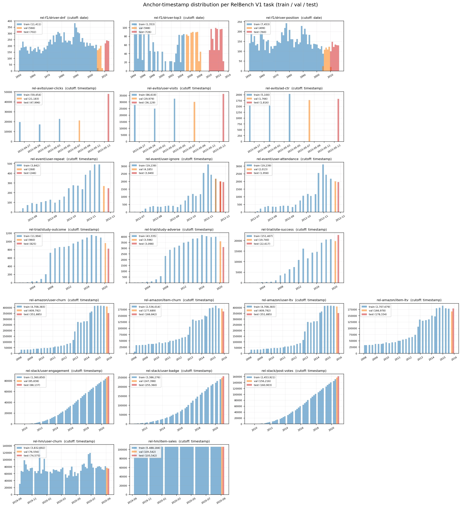

# Nested temporal validation

RelBench entity tasks are temporal: every example is an `(entity, anchor
timestamp)` pair, whose timestamp describes the point in time being predicted.
The task splits are also defined by time: `train` anchors precede
`val_timestamp`, `val` anchors fall in `[val_timestamp, test_timestamp)`, and
`test` anchors are at or after `test_timestamp`.



Each panel shows the train, validation, and test anchor timestamps for one
RelBench V1 task. Validation and test anchors lie at or beyond the end of the
history available to the preceding training phase.

## Why the database cutoff matters

RelBench normally gives a model one database censored at `test_timestamp`. A
model that wants to respect each example's anchor timestamp must enforce it
itself, for example by limiting an aggregation or temporal neighborhood to rows
at or before that anchor. This is leakage-free, but it creates different
information conditions for validation and test:

- Validation anchors fall before the database cutoff, so their available
  history can advance from one anchor to the next.
- Test anchors are at or after the database cutoff, so the available database
  history cannot advance beyond `test_timestamp`.

Consequently, historical aggregates can be fresh for validation but frozen for
test. Features derived from the anchor itself, such as calendar features or
time-since-event values, can still vary; it is the underlying database state
that is frozen, not necessarily the entire feature vector.

For example, the observation that originally motivated this protocol was the
following `COUNT(results)` feature for driver 0 on `rel-f1/driver-dnf` when both
splits used the test-censored database:

| Split | Historical count across anchor timestamps |
| --- | --- |
| `val` | 0 → 1 → 3 → … → 17 |
| `test` | 52, 52, 52, … |

Tuning a choice such as DFS depth on the evolving validation history and then
applying it to the frozen test history introduces a validation/test distribution
shift.

## RelArena's inner and outer splits

RelArena uses two database states so model selection and final evaluation see
the same kind of information boundary:

| Phase | Split | Database censored at | Fit data | Evaluation data |
| --- | --- | --- | --- | --- |
| Tune and select | `InnerSplit` | `val_timestamp` | `train` | `val` |
| Final evaluation | `OuterSplit` | `test_timestamp` | determined by `refit_on_full_data` | masked `test` |

The database state is part of each split object. `RelBenchDatasetTask.inner_split()`
constructs a val-censored database, while `outer_split()` constructs a
test-censored database. The runner and tuner consume those split objects instead
of censoring databases themselves:

```python
source = RelBenchDatasetTask(dataset_name, task_name)

inner = source.inner_split()
trials = tune(..., split=inner)

outer = source.outer_split()
result = refit_and_evaluate(..., split=outer)
```

The inner database cannot expose history after `val_timestamp`, so validation
aggregates are frozen at the inner boundary just as test aggregates are frozen
at the outer boundary. RelArena also withholds test labels from the model-facing
split. Together, these guarantees prevent test-label leakage and access to data
after the applicable phase boundary.

Within a censored database, a model may additionally enforce each row's anchor
timestamp, for example through DFS cutoff joins or temporal neighbor sampling.
RelArena does not require that choice: a method may treat the entire censored
database as available to every anchor. Doing so cannot reveal test labels or
post-boundary data, and it does not recreate the alternative evaluation regime
that advances the database to each test entity's timestamp.

The implementation lives in [`dataset.py`](../src/relarena/dataset.py). The
orchestration is in [`runner.py`](../src/relarena/runner.py) and
[`tuner.py`](../src/relarena/tuner.py).

## Final-fit regimes

After selecting a configuration on the inner split, RelArena evaluates it on the
outer split using the model's `refit_on_full_data` setting:

- With `refit_on_full_data=True` (the default), the model refits on `train + val`.
- With `refit_on_full_data=False`, the model trains on `train` and receives `val`
  as a monitoring set, allowing it to report a validation-selected checkpoint.

Both regimes predict on the masked test table using the test-censored outer
database. Test labels are not present in the split object and are only accessed
by RelBench during scoring. See
[`adding-a-model.md`](adding-a-model.md#3e-refit-on-full-data) for the model-level
choice between these regimes.

## Scope and trade-off

Phase-specific censoring matters for models whose features or neighborhoods
depend on relational history, including the current DFS-, TFM-, and graph-based
model families (`rdblearn`, `tabpfn-rel-*`, `graphsage`, `relgnn`, and `relgt`).
It does not materially change the parameter-free
constant baselines (`constant-global`, `constant-per-entity`) or entity-only `lightgbm`.

This protocol deliberately differs from the usual RelBench convention of using
one test-censored database for both validation and test. In exchange, validation
more closely matches the information boundary used for the reported test score.
Comparisons with results produced under the usual RelBench convention should
account for that difference.
